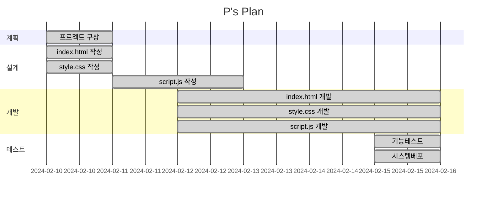

# Ps Plan 여행 추천

## 목표
* GPT를 이용 여행 추천 서비스

## 기능
* 여행 일정 추천 받습니다.

## WBS
* 아래 일정표는 머메이드로 작성했습니다.

## 프로젝트 구조

## 와이어 프레임

|메인화면|설명|
|------|----|
||페이지 오픈시 팝업화면 구현|
||여행 위치, 일자, 차량 렌트 여부 입력|
||GPT를 통해 여행의 전반적인 계획 수신|
